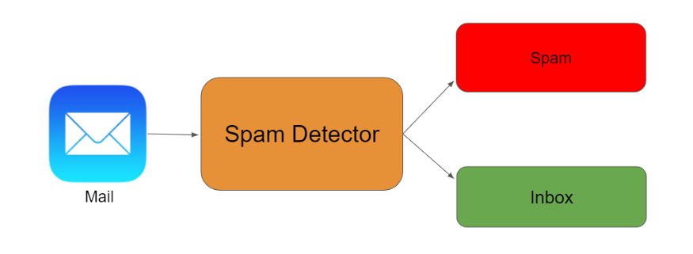

  
 

<h3> Link to Site- https://spam-classifier-flask-app.herokuapp.com/ </h3>

 <i> <h2> Spam Classifier </h2>

<h3><i>E-mail is one of the most popular and frequently used ways of communication due to its worldwide accessibility, relatively fast message transfer, and low sending cost. The flaws in the e-mail protocols and the increasing amount of electronic business and financial transactions directly contribute to the increase in e-mail-based threats. Email spam is one of the major problems of the today's Internet, bringing financial damage to companies and annoying individual users. </h2>
   
  <i> <h2> Spam Classifier using Naive Bayes</h2>

<h3><i>Spam classifier machine learning model is need of the hour as everyday we get thousands of mails and don’t have time to manually reject each spam. 
Textual data is everywhere be it tweets, posts, or documents. Text based classification models have great applications. </h2>

 

<h2> Project details

<h3> This project is divided into three parts that are:  
<h3>1. Building our Spam Classifier model
<h3>2. Building a web application on which we can mount our model.
<h3>3. Lastly deploying the web application on Heroku.

  

 

  <h2> Tech Stack   </h2>
<h3> 1.Python  
<h3> 2.Flask  
<h3> 3.NLP  
<h3> 4.SVM

     
  
  <h1> Screenshots </h1>
  <h2> Input Screen </h2>
 
  
    
  
<h2> Output Screen </h2> 

   
  
    

### Give It a Star if you liked the project 
